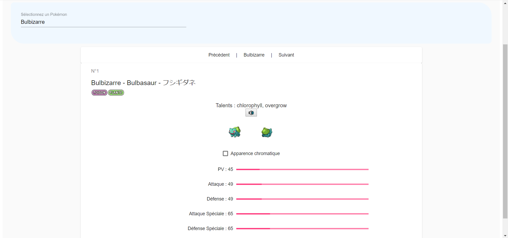

# Pokedex-Angular

Dans ce Git, vous trouverez le rendu du projet Pokédex utilisant Angular et initié en cours d'Interfaces Homme Machine durant ma deuxième année à l'ESIR.

## Rapport
### Résumé

Ce Pokédex utilise l'API PokéAPI pour récupérer l'ensemble des données utilses. L'aspect graphique est principalement fourni par Angular Material, et j'ai utilisé un peu de CSS natif par endroits.

L'apparence est la suivante :



En-dessous du titre, on trouve un ```autocomplete```. Celui-ci est relié à un pipe, ce qui permet de filtrer les résultats en fonction de ce que l'on écrit. Il ne marche qu'avec le nom du Pokémon, et pas son ID. Un sprite de chaque Pokémon s'affiche dans la liste pour permettre de mieux les visualiser, cela explique un petit temps de chargement à l'ouverture de la page. Voici l'aperçu lorsque l'on commence à taper dans celle-ci :


Une fois le Pokémon sélectionné, un composant s'ouvre. La barre "de navigation" permet d'accéder au Pokémon précédent ou suivant en cliquant sur le mot voulu. S'affichent ensuite l'ID du Pokémon, ses noms en français, anglais et japonais, son ou ses types, son ou ses talents, son apparence classique (et chromatique via une checkbox) ainsi que ses statistiques de base.


### Structure

L'appli web est composée d'un composant père appelé ```app.component```. C'est ici que sont liés tous les composants fils entre eux. On en compte 3 :
* ```my-component``` est le composant comprenant la barre de recherche (plus la barre de navigation)
* ```affichage-pkmn``` gère l'affichage de toutes les informations du Pokémon sélectionné
* ```snack-bar``` est un petit composant qui gère seulement l'affichage d'un message d'alerte. Il n'est d'ailleurs pas défini dans son propre fichier, mais dans```my-component.component.ts```


Dans un premier temps, j'ai suivi les consignes données dans le sujet de TP. Il y avait donc une barre de recherche, un select, et un autre ```input``` disabled qui affichait seulement le texte tapé dans la barre de recherche. Le pipe était mis en place, et en fonction du texte tapé, le nombre d'options du select diminuait. L'affichage était le suivant :


Il a ensuite fallu afficher les informations du Pokémon dans l'autre composant. Pour cela, il faut transmettre les données entre composants. On commence donc par l'exporter de la classe ```my-component``` de la manière suivante :
```typescript
@Output() affichagePokemonDemandé = new EventEmitter<Pokemon>();
```
L'information est ainsi remontée au composant père ```app.component```, et utilisée sous forme d'évènement dans la code HTML :
```html
<app-my-component (affichagePokemonDemandé)="associerPokemon($event)"></app-my-component>
```
Si l'évènement a lieu, alors on exécute la fonction associerPokémon. Cela permet de récupérer les données dans une variable. Dans la classe typescript ```affichage-pkmn```, on permet l'utilisation d'un argument avec la ligne suivante :
```typescript
@Input() pokemon: Pokemon;
```

Ainsi, lors que l'utilisation côté HTML, il suffit de passer la variable contenant les informations en paramètre :
```html
<app-affichage-pkmn [pokemon]="pokemon" *ngIf="isReady"></app-affichage-pkmn>
```

J'ai alors pu afficher les informations me paraissant les plus pertinantes, mais vu la richesse de l'API, il aurait été possible d'en afficher bien davantage.

Dans un dernier temps, j'ai décidé de mettre en place l'autocomplete, qui permet de fusionner l'input de tri et le select dans un seul et même composant.

J'avais pour idée d'avoir une solution multilangue. Pour cette raison, les noms des Pokémons ainsi que leurs descriptions sont stockées en plusieurs langues, et une petite barre de menu est située toute en haut de la page pour choisir sa langue. Néanmoins, je n'ai pas eu le temps de l'implémenter, mais j'ai voulu laisser mes modifications en place pour montrer mon avancement.